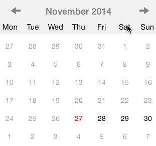

SHPCalendarPicker
===========
SHPCalendarPicker is a UI component for showing calendar picker

* Automatically adjust to fit within container view.
* Customizable
* ~> iOS7

If you have any problems please look at the sample code or ask!

#Setting it up

Install using CocoaPods

	pod 'SHPCalendarPicker'
	
#Using it

Create and show ``SHPCalendarPicker``

    SHPCalendarPickerView *calendarPickerView = [[SHPCalendarPickerView alloc] init];
    [self.view addSubview:calendarPickerView];
    
#Customizing it
The component can be customized a lot. Please look in ``SHPCalendarPickerView.h`` for more info.